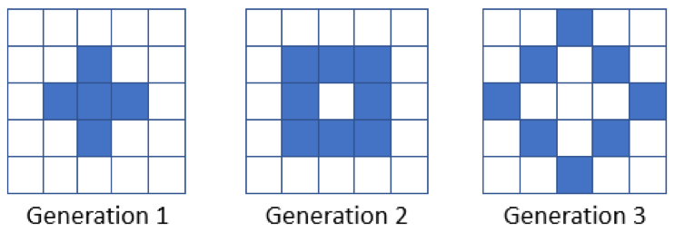
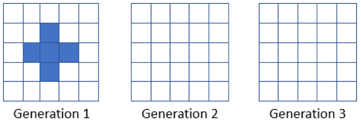

### Tech challenge #1
*This challenge info can also be found at aka.ms/a11ygol*

The October 1970 issue of Scientific American introduced John Conway’s Game of Life, a cellular automata exercise in which grids of cells “evolve” from one generation to the next using a simple set of rules:

- If a live cell has less than two neighbors, it dies from starvation in the next generation
- If a live cell has exactly two or three neighbors, it survives in the next generation
- If a live cell has more than three neighbors, it dies from overpopulation in the next generation
- If an empty cell has exactly three neighbors, it becomes a live cell in the next generation
The Game of Life has been the subject of countless computer simulations. 

Suppose grid is a 2-dimensional array of 1s and 0s, with 1s representing live cells and 0s representing empty cells, that is declared this way in three popular programming languages:

```
# Python
grid = [
    [0, 0, 0, 0, 0],
    [0, 0, 1, 0, 0],
    [0, 1, 1, 1, 0],
    [0, 0, 1, 0, 0],
    [0, 0, 0, 0, 0]
]

// JavaScript and C#
var grid = [
    [0, 0, 0, 0, 0],
    [0, 0, 1, 0, 0],
    [0, 1, 1, 1, 0],
    [0, 0, 1, 0, 0],
    [0, 0, 0, 0, 0]
];
```

In the next generation, grid will look like this:
```
    [0, 0, 0, 0, 0],
    [0, 1, 1, 1, 0],
    [0, 1, 0, 1, 0],
    [0, 1, 1, 1, 0],
    [0, 0, 0, 0, 0]
```
And in the third generation, it will look like this:
```
    [0, 0, 1, 0, 0],
    [0, 1, 0, 1, 0],
    [1, 0, 0, 0, 1],
    [0, 1, 0, 1, 0],
    [0, 0, 1, 0, 0]
```

Here is the same sequence pictorially:


If result is a 2-dimensional array of the same size as grid, the following code evolves grid from one generation to the next and writes the results to result:

```python
# Python
for i in range(len(grid)):
    for j in range(len(grid[i])):
        count = countNeighbors(grid, i, j)
        if count < 2 or count > 3:
            result[i][j] = 0
        elif count == 2:
            result[i][j] = (grid[i][j] + 1) % 2
        else:
            result[i][j] = 1
```
```javascript
// JavaScript
for (var i=0; i < grid.length; i++) {
    for (var j=0; j < grid[i].length; j++) {
        var count = countNeighbors(grid, i, j);
        if (count < 2 || count > 3)
            result[i][j] = 0;
        else if (count == 2)
            result[i][j] = (grid[i][j] + 1) % 2;
        else
            result[i][j] = 1;
    }
}
```
```cs
// C#
for (var i=0; i < grid.Length; i++)
{
    for (var j=0; j < grid[i].Length; j++)
    {
        var count = countNeighbors(grid, i, j);
        if (count < 2 || count > 3)
            result[i][j] = 0;
        else if (count == 2)
            result[i][j] = (grid[i][j] + 1) % 2;
        else
            result[i][j] = 1;
    }
}
```

However, the code above doesn’t faithfully implement the rules of Life. There is one subtle difference. Determine what that difference is and then use it to evolve th following grid through two generations:


When you’re finished, you must convert the grid to a URL to move on to the next challenge using these instructions:
1. Convert every row to a string of binary digits
    (e.g. the gen 1 board would convert to: ‘00000’ ‘00100’ ‘01110’ ‘00100’ ‘00000’)
1. Concatenate all the 5-digit strings together
1. Pad the resulting bit string with leading 0s to get to 32 bits.
1. Do a bitwise XOR operation between the resulting series of bits and the series of bits listed below:

	
    ```
    01100001 10001001 11110111 00010110
    ```


1. Group the resulting series of bits into groups of 8, then convert them to ASCII so that you have 4 characters (‘xxxx’)
6. Find the next part of the challenge at aka.ms/xxxx 